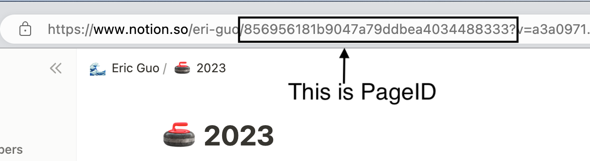

</img>

# Notion-Blog-Template

Create your personal blog website powered by Notion Nextjs and Vercel

创建你的个人博客网站，由 Notion, Nextjs 和 Vercel 驱动

Concentrate on writing content instead of how to deploy and maintain app

聚焦在博文的写作和管理上，将你从部署和维护中解放出来

## 🎯 Features

**Write post using Notion**

**使用 Notion 写作博文**

- Use the most convenient way to write, publish and manage blog posts

    使用最便捷的方式来书写,发布,管理博文
    
- Make full use of Notion's block to improve writing efficiency

    利用 Notion 页面已有的各类功能，方便地写作博文
    
- Automaticlly sync post when updating anything in Notion

    将 Notion 内容的修改，自动同步到 Blog

**Low cost in Deployment and maintenance**

**低成本的部署和维护**

- Deploy project on Vercel, one-click deployment

    使用 Vercel 托管网站，一键完成部署

**Easily extend website functionality with Nextjs**

**使用 Nextjs 方便地扩展网站功能**

- Like to add some new ideas to your blog? The Next.js framework is ready.

    想扩展网站的功能? Nextjs 框架已经准备好了

## 🚀 How to get started

### Deploy

1. Duplcate this [Notion-blog-template](https://eri-guo.notion.site/7bd351f02d8b41a791d23c939d27cefe?v=62962322ea5144459db66c4567aa2719), and share it to web

   将[Notion-blog-template](https://eri-guo.notion.site/7bd351f02d8b41a791d23c939d27cefe?v=62962322ea5144459db66c4567aa2719)这个 Notion 模版复制到你自己的工作区

2. Fork or clone this repo

   Fork 或 clone 这个仓库

3. Deploy project on [Vercel](https://vercel.com/new)

   在[Vercel](https://vercel.com/new)上部署你的项目

   - Get your pageId
   
       获取你的页面 ID

     

   - Import git repo into Vercel
   
       在 Vercel 中导入 git 项目

   - Set NOTION_PAGE_ID = `pageId` as an environment variables
   
       将 pageId 设置为名为 NOTION_PAGE_ID 的环境变量

   - Build & 😆Congratulation
       
       好耶 😆

### Develop

1. Config in **site.config.js**

   在**site.config.js**文件中进行必要的配置

2. Dont forget to set environment variables `NOTION_PAGE_ID`

   别忘了配置 NOTION_PAGE_ID 这个环境变量哦

3. Develop it~

   可以开始本地开发啦～

## 🍻 Contributors

[react-notion-x](https://github.com/NotionX/react-notion-x)

[nobelium](https://github.com/craigary/nobelium)

### Special Thanks

<table>
<tr align="left">
  <td align="center"> <a href="https://github.com/ycjcl868/blog" title="ycjcl868">ycjcl868</a></td>

  <td align="center"> <a href="https://github.com/morethanmin/morethan-log" title="morethanmin">morethanmin</a></td>
</tr>
</table>

# License

The MIT License.
